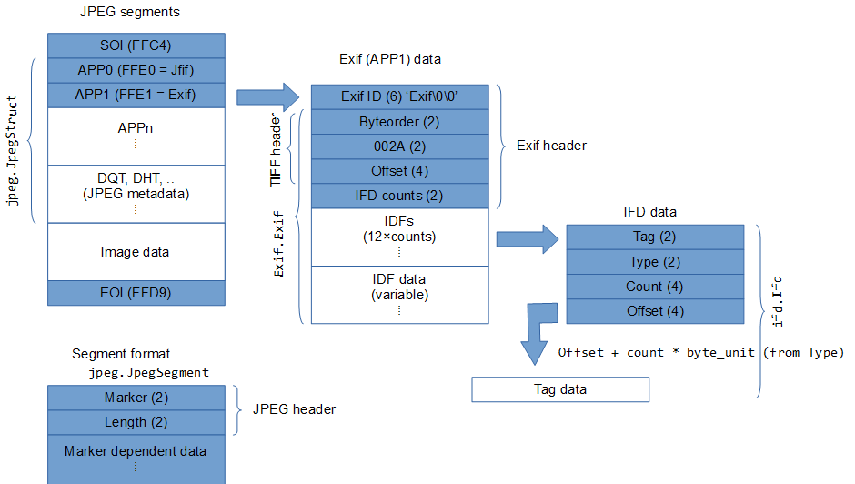

# Exif reader

> Not designed for Jpeg file manipulation (write/modify). It's just a reader.

## Synposis

- `jpeg.py`: Breaks a Jpeg file into segments (such as APP1). Does not parse the data section of the segments.
	- Class `JpegMarkers`: A container (dict) for the Jpeg markers (reads `jpeg.json` below).
	- Class `JpegStruct`: Parse a Jpeg file into segements.
- `jpeg.json`: A json text file containing Jpeg markers.
- `exif.py`: Parse the Exif segment obtained from `jpeg.py`. Does not parse the IFD parts within the Exif segments.
	- Class `ByteOrder`: Obtain the byte order string (`little` or `big`) from the two bytes codes (4949<sub>16</sub> or 4D4D<sub>16</sub>).
	- Class `Exif`: Parse an Exif segment (APP1).
- `jfif.py`: Parse the Jfif segment from `jpeg.py`. Ignores thumbnail data.
	- Class `Jfif`: Parse an Jfif segment (APP0).
- `ifd.py`: Parse the IFDs from the Exif segment from `exif.py`.
	- Class `IfdInfo`: A container (dict) for IFD tags and types.
	- Class `Ifd`: Parse a IFD field.
- `ifd.json`: A json text file containing IFD tags and Type descriptions.

## Examples

### JpegMakers

Load the Jpeg marker value:names.

```
>>> import jpeg                                          # Import jpeg.py
>>> makers = jpeg.JpegMarkers()                          # The json file is read only once (singleton)
>>> makers.get_names_all()                               # Returns dict (formatted by hand for readability)
{'FFC0': 'SOF0 (Start of Frame 0)', 'FFC1': 'SOF1 (Start of Frame 1)',
 'FFC2': 'SOF2 (Start of Frame 2)', 'FFC3': 'SOF3  Start of Frame 3)',
 'FFC4': 'DHT (Define Huffman Table)', 'FFC5': 'SOF5 (Start of Frame 5)',
 'FFC6': 'SOF6 (Start of Frame 6)', 'FFC7': 'SOF7 (Start of Frame 7)',
 'FFC8': 'JPG (JPEG Extensions)', 'FFC9': 'SOF9 (Start of Frame 9)',
 'FFCA': 'SOF10 (Start of Frame 10)', 'FFCB': 'SOF11 (Start of Frame 11)',
 ... snip
 'FFFE': 'COM (Comment)'}
>>> makers.get_name('FFD8')                              # Name of the specific marker
'SOI (Start of Image)'
```

### JpegStruct

Read a Jpeg file and parse into segments.

```
>>> jpeg_struct = jpeg.JpegStruct('/mnt/j/photos/2021/IMG_3199.jpg')   # Read & parse
>>> print(jpeg_struct)                                                 # Found 7 segments
{'marker_int': 65505, 'marker_hex': 'FFE1', 'marker_name': 'APP1 (Application Segment 1; EXIF)', 'length': 2022}
{'marker_int': 65514, 'marker_hex': 'FFEA', 'marker_name': 'APP10 (Application Segment 10)', 'length': 620}
{'marker_int': 65499, 'marker_hex': 'FFDB', 'marker_name': 'DQT (Define Quantization Table)', 'length': 130}
{'marker_int': 65501, 'marker_hex': 'FFDD', 'marker_name': 'DRI (Define Restart Interval)', 'length': 2}
{'marker_int': 65472, 'marker_hex': 'FFC0', 'marker_name': 'SOF0 (Start of Frame 0)', 'length': 15}
{'marker_int': 65476, 'marker_hex': 'FFC4', 'marker_name': 'DHT (Define Huffman Table)', 'length': 416}
{'marker_int': 65498, 'marker_hex': 'FFDA', 'marker_name': 'SOS (Start of Scan)', 'length': 10}
```

Extract the exif segment.

```
>>> exif = jpeg_struct.get_segment(0xFFE1)               # APP1 = Exif = FFE1
>>> exif                                                 # Returns JpegSegment object
<jpeg.JpegSegment object at 0x7f977fac49d0>
>>> print(exif)                                          # a segment in dict format
{'marker_int': 65505, 'marker_hex': 'FFE1', 'marker_name': 'APP1 (Application Segment 1; EXIF)', 'length': 2022}
```

### Exif

Parse the Exif (APP0) data segment (obtained from JpegStruct) into its fields. It calls ifd.Ifd class to parse the IFD fields.

```
>>> from jpeg import JpegStruct                          # Import Jpeg parser
>>> from ifd import Ifd                                  # Import Ifd parser
>>> from exif import Exif                                # Import Exif parser

>>> jpeg_struct = JpegStruct('/mnt/j/photos/2021/IMG_0252.jpg')
>>> app1_data = jpeg_struct.get_segment(0xFFE1)
>>> str(app1_data)
"{'marker_int': 65505, 'marker_hex': 'FFE1', 'marker_name': 'APP1 (Application Segment 1; EXIF)', 'length': 2194}"

>>> len(app1_data)                                       # Returns the length of data part (excluding header)
2194
>>> len(app1_data.data)                                  # data part
2194
>> app1_data.data[:16]                                   # Header part in the 1st 16 bytes
b'Exif\x00\x00MM\x00*\x00\x00\x00\x08\x00\r'

>> exif_struct = Exif(app1_data.data)                    # Parse Exif fields
>>> str(exif_struct)
"{'Byte order': 'big', 'Offset': 14, 'IFD count': 13, 'IFDs': [{'tag': 'Make', 'type': 'ASCII', 'value': 'Apple'}, {'tag': 'Model', 'type': 'ASCII', 'value': 'iPhone SE (2nd generation)'}, {'tag': 'Orientation', 'type': 'SHORT', 'value': 6}, {'tag': 'XResolution', 'type': 'RATIONAL', 'value': Fraction(72, 1)}, {'tag': 'YResolution', 'type': 'RATIONAL', 'value': Fraction(72, 1)}, {'tag': 'ResolutionUnit', 'type': 'SHORT', 'value': 2}, {'tag': 'Software', 'type': 'ASCII', 'value': '14.7.1'}, {'tag': 'DateTime', 'type': 'ASCII', 'value': '2021:09:25 13:23:14'}, {'tag': 'Host Compduiter', 'type': 'ASCII', 'value': 'iPhone SE (2nd generation)'}, {'tag': 'TileWidth', 'type': 'LONG', 'value': 512}, {'tag': 'TileHeight', 'type': 'LONG', 'value': 512}, {'tag': 'YCbCrPositioning', 'type': 'SHORT', 'value': 1}, {'tag': 'Exif IFD Pointer', 'type': 'LONG', 'value': 276}]}"
```

### Jfif

Parse the Jfif (APP1) data segment (obtained from JpegStruct) into its fields.

```
>>> from jpeg import JpegStruct
>>> import jfif

>>> jpeg_struct = JpegStruct('/mnt/j/photos/2021/IMG_0252.jpg')
>>> app0_data = jpeg_struct.get_segment(0xFFE0)
>>> type(app0_data)                                      # Returns None when APP0 is not present.
<class 'NoneType'>

>>> jpeg_struct = JpegStruct('/mnt/j/photos/2021/20210319_191110.jpg')
>>> app0_data = jpeg_struct.get_segment(0xFFE0)
>>> str(app0_data)
"{'marker_int': 65504, 'marker_hex': 'FFE0', 'marker_name': 'APP0 (Application Segment 0; JFIF)', 'length': 14}"

>>> jfif_obj = jfif.Jfif(app0_data.data)                 # Parse
>>> str(jfif_obj)
"{'version': '1.1', 'Units': 'dots per cm', 'Xdensity': 59, 'Ydensity': 59, 'Xthumbnail': 0, 'Ythumbnail': 0}"
```

## Jpeg/Exif/Ifd structure


